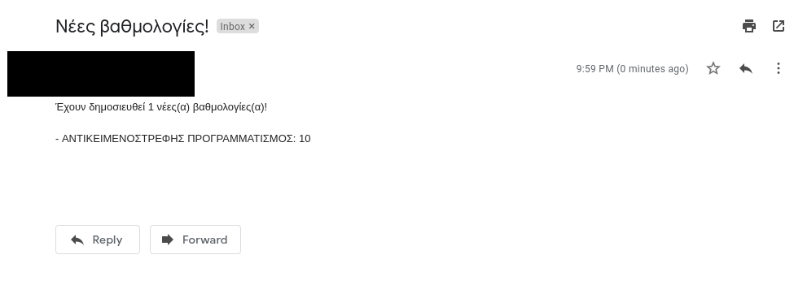

# unipi-notify
A service that notifies you when new grades are released.

***
### Please be reasonable with the frequency of requests. This wasn't intended to be a service that will notify you immediately.
***

## Example e-mail


## Quick start
This section will show you how to install and run the program.

### Requirements
Make sure you have everything that is mentioned below installed before proceeding to the next step.

```
- docker
- docker-compose
- Google account (or some SMTP service)
```

### Edit configuration files
Go to the config folder and rename  
`smtp.example.json -> smtp.json`  
and  
`user.example.json -> user.json`  
with the details of your SMTP server and Unipi account respectively.

#### Note
+ If you have a Google account, you have a [free basic SMTP server](https://support.google.com/a/answer/176600?hl=en) already included.
+ If you use the above-mentioned SMTP server, you will need to create an app password from your [Google account security page](https://myaccount.google.com/security) and use that as your password.

***

#### Example (Google account)
Your configuration files should look like this.

*smtp.json*
```json
{
    "address": "smtp.gmail.com",
    "ssl": 465,
    "tls": 587,
    "email": "john@gmail.com",
    "password": "app password"
}
```
*user.json*
```json
{
    "username": "E12345",
    "password": "unipi password"
}
```

***

After doing that, simply run the app using:

```
sudo docker-compose up
```

That's it! You can also modify `notify.json` but that is not recommended.

## Testing
This has only been tested on Ubuntu 20.04 LTS.

## Thanks
Special thanks to [Nikos Sklavounos](https://github.com/NickSklA) for creating the API.

### Disclaimer
This service is neither affiliated nor endosered in any way by the University of Piraeus. This was created solely of convience
